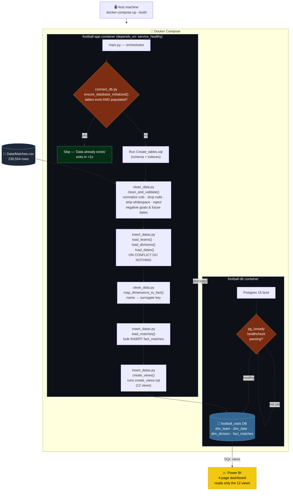
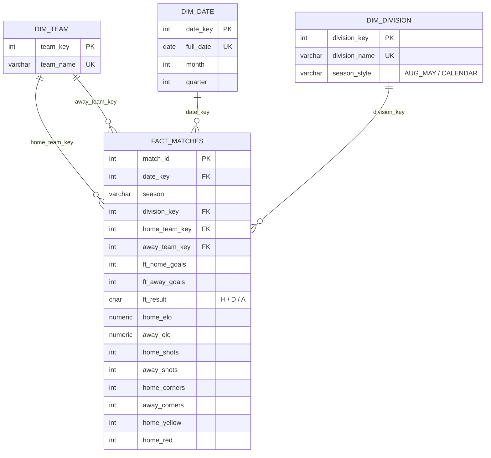
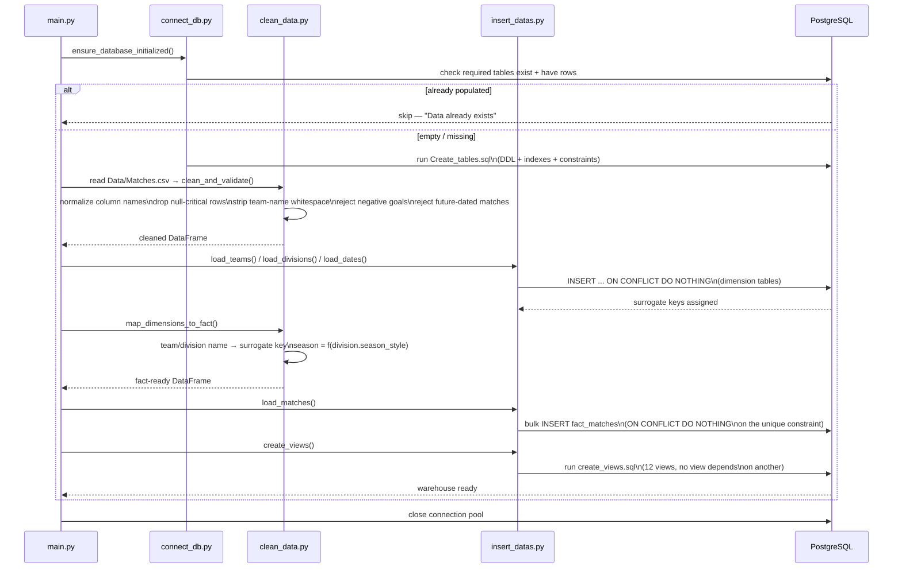
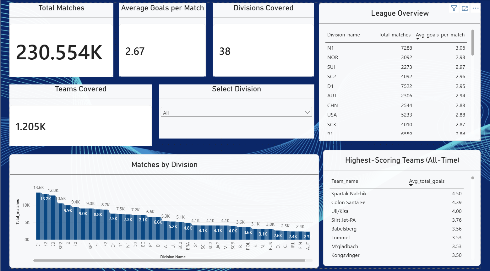
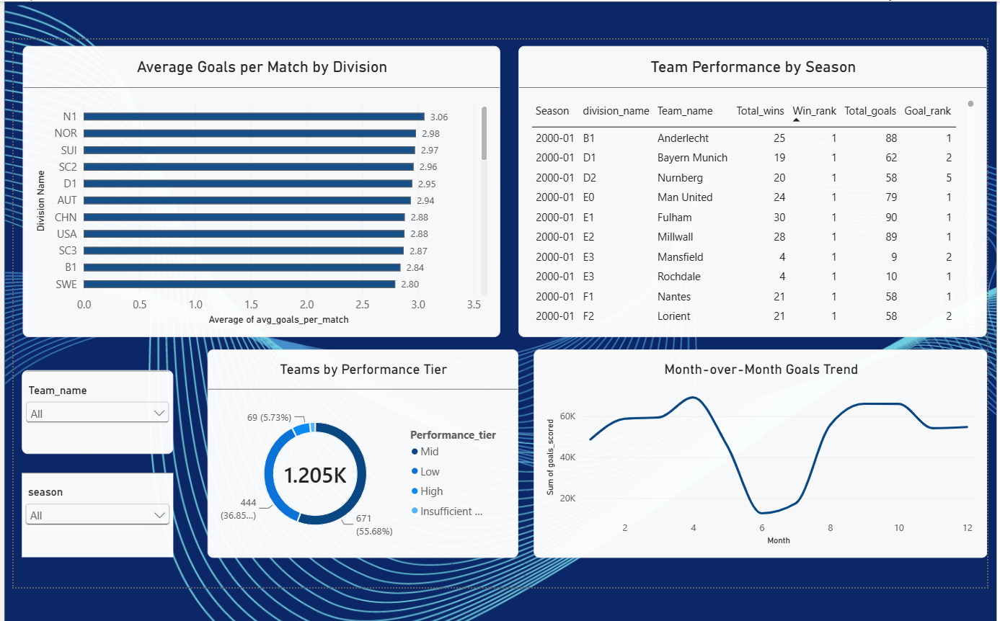
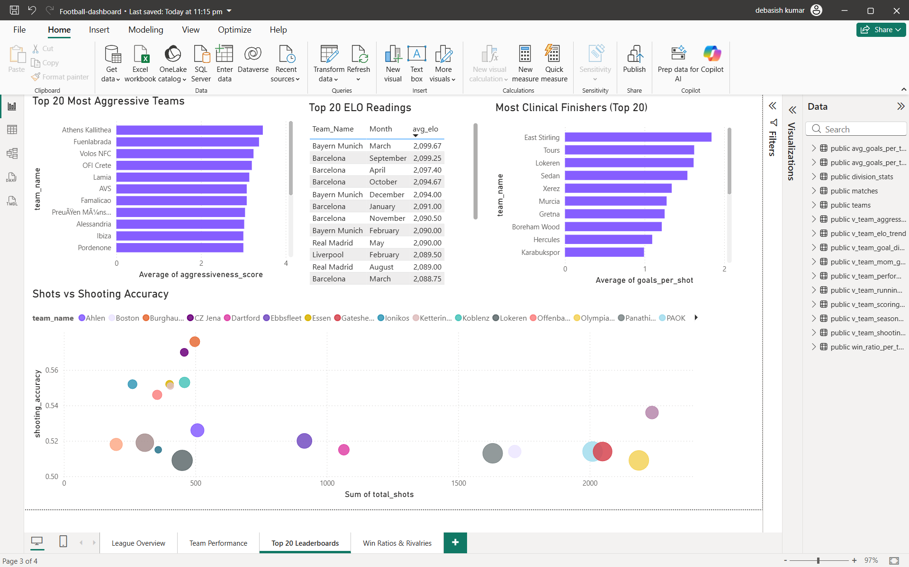
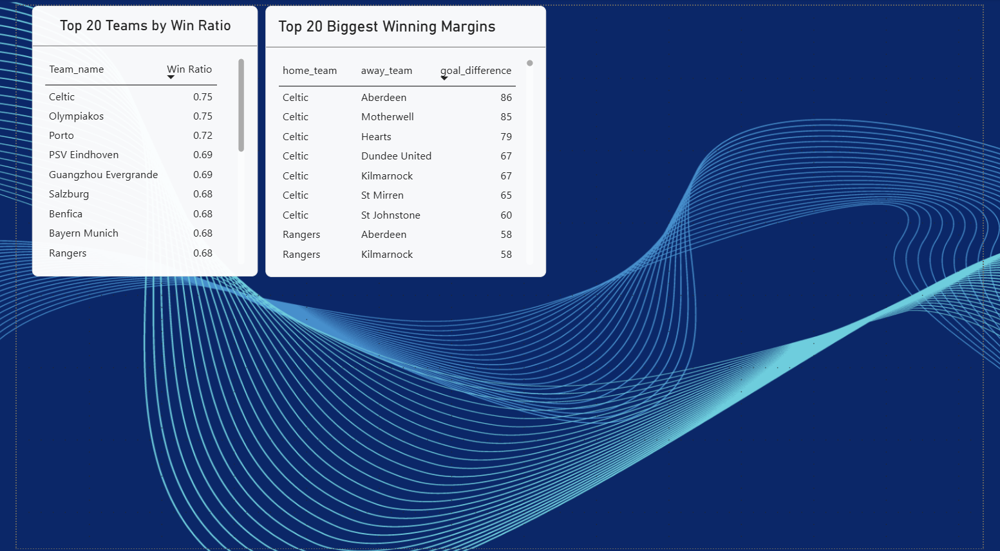

<div align="center">

# ⚽ Football Analytics Warehouse

### A production-shaped data engineering pipeline that turns 25 years of raw football data into a queryable, containerized dimensional warehouse — and a 4-page BI dashboard on top.


**230,554 matches · 1,206 teams · 38 divisions · 9,075 days · 12 analytical SQL views · 100% containerized**

</div>

---

## 📖 Table of Contents

- [Overview](#-overview)
- [Architecture](#-architecture)
- [Data Model — Star Schema](#-data-model--star-schema)
- [ETL Pipeline — How the Data Actually Moves](#-etl-pipeline--how-the-data-actually-moves)
- [Analytical Views](#-analytical-views)
- [Engineering Challenges Solved](#-engineering-challenges-solved)
- [Tech Stack](#-tech-stack)
- [Project Structure](#-project-structure)
- [Getting Started](#-getting-started)
- [Power BI Dashboard](#-power-bi-dashboard)
- [Design Decisions & Trade-offs](#-design-decisions--trade-offs)
- [Roadmap](#-roadmap)

---

## 🧭 Overview

This project takes a **230K-row CSV of raw European (and beyond) football match data spanning 2000–2025** and turns it into something a real analytics team could actually query, trust, and build dashboards on.

It is **not** "load a CSV into a table and call it a day." The pipeline:

- **Cleans and validates** raw data (nulls, negative scores, impossible future dates, inconsistent team-name whitespace)
- **Normalizes it into a dimensional star schema** (`dim_team`, `dim_date`, `dim_division`, `fact_matches`) instead of one wide flat table
- **Runs entirely inside Docker** — one command spins up Postgres *and* the ETL app, wired together with a proper health-checked dependency chain
- **Is idempotent** — re-running the pipeline against an already-populated database is a no-op, not a duplicate-data disaster
- **Exposes 12 SQL views** — 8 descriptive, 4 built on window functions (`RANK`, running `SUM`, `LAG`) — as the single interface the BI layer talks to
- **Feeds a 4-page Power BI dashboard** with team/season slicers, leaderboards, and rivalry breakdowns

The goal was to simulate, as closely as possible in a solo project, what a junior data engineer is actually asked to do: take messy real-world data, model it properly, containerize it so it runs anywhere, and hand analysts a clean, indexed, bug-free warehouse to build on.

---

## 🏗️ Architecture



Everything left of Power BI runs from a single `docker-compose up --build`. Two gates matter here: `football-db` won't be considered "up" by Compose until its own `pg_isready` healthcheck passes, and `football-app` won't even attempt a connection until Compose reports that healthcheck green (`depends_on: condition: service_healthy`) — which is what eliminates the startup-race crash documented below. A second, independent gate then runs inside the app container itself: `ensure_database_initialized()` checks whether the warehouse already has data before doing any work at all.

---

## 🗃️ Data Model — Star Schema

The warehouse was deliberately migrated from an early flat two-table design to a **proper star schema**, because a flat table stops scaling the moment you need season-over-season or month-over-month analysis.



| Table | Type | Rows | Role |
|---|---|---|---|
| `dim_team` | Dimension | 1,206 | Surrogate-keyed team lookup |
| `dim_date` | Dimension | 9,075 | Fully populated calendar (no gaps) — month & quarter pre-computed |
| `dim_division` | Dimension | 38 | League lookup, tagged with `season_style` (see below) |
| `fact_matches` | Fact | 230,554 | Every match: pre-match ELO/form, in-game stats, full & half-time results |

`fact_matches` is indexed on `date_key`, `division_key`, and `(home_team_key, away_team_key)` — the three join paths every analytical view actually uses — and carries a `UNIQUE(date_key, home_team_key, away_team_key)` constraint that doubles as the idempotency guard on re-load.

**Why `season_style` exists:** most European leagues run Aug→May, but leagues like the USA, Sweden, Norway, and Ireland run on the calendar year. A single hardcoded "season = Aug–May" rule silently mis-bucketed every match in those leagues — `season_style` on `dim_division` is what the ETL uses to branch the season-calculation logic correctly per division (see [Engineering Challenges](#-engineering-challenges-solved)).

---

## ⚙️ ETL Pipeline — How the Data Actually Moves



**Idempotency, concretely:** `ensure_database_initialized()` doesn't just check the tables exist — it checks each one actually has rows. Re-running `docker-compose up` against a warehouse that's already loaded exits in under a second instead of trying (and failing) to re-insert 230K rows. The same guarantee is enforced a second, independent way at the database level: `fact_matches` carries a `UNIQUE(date_key, home_team_key, away_team_key)` constraint, so even a bypass of the Python-level check couldn't produce duplicate fact rows.

---

## 📈 Analytical Views

All 12 views sit directly on top of `fact_matches` + the dimension tables — no view depends on another, so they rebuild in one pass every time the pipeline runs.

**Descriptive**

| View | What it answers |
|---|---|
| `avg_goals_per_team` | Avg. goals scored/conceded per team (home *and* away merged via `UNION ALL`) |
| `win_ratio_per_team` | Win ratio per team across all competitions |
| `division_stats` | Match count + avg. goals per division |
| `v_team_elo_trend` | Monthly average ELO per team |
| `v_team_shooting_efficiency` | Shots → shots-on-target accuracy |
| `v_team_aggressiveness` | Weighted fouls/yellow/red "aggressiveness score" |
| `v_team_scoring_efficiency` | Goals per shot & goals per shot-on-target |
| `v_team_goal_difference` | Head-to-head aggregate goal difference (rivalry heatmap source) |

**Advanced — window functions**

| View | Technique | What it answers |
|---|---|---|
| `v_team_season_ranking` | `RANK() OVER (PARTITION BY season, division)` | Where does this team rank by wins *and* goals, within its own season and division? |
| `v_team_running_totals` | `SUM() OVER (... ROWS UNBOUNDED PRECEDING)` | Cumulative points & goals match-by-match through a season |
| `v_team_mom_goals` | `LAG() OVER (PARTITION BY team ORDER BY year, month)` | Month-over-month scoring trend, correctly skipping gaps in the calendar |
| `v_team_performance_tier` | `CASE` segmentation on win ratio | High / Mid / Low tier, with a floor guard (`< 10 matches` → "Insufficient Data") so small samples don't get mislabeled |

---

## 🔧 Engineering Challenges Solved

These weren't hypothetical — each one broke the pipeline or the data at some point and had to be root-caused:

| Bug | Root Cause | Fix |
|---|---|---|
| **Division lookups silently failing** | `division_name` was `CHAR(4)` — Postgres right-pads fixed-length strings, so `'F1  '` ≠ `'F1'` on join | Switched the column to `VARCHAR` |
| **App container crashing on startup** | `football-app` connected to Postgres before it had finished initializing | Added a `pg_isready` healthcheck + `depends_on: condition: service_healthy` |
| **Code changes not reflected in container** | Docker was serving a stale cached image layer | Standardized on `docker-compose up --build`, documented in the run instructions |
| **Wrong ELO values / DB unreachable locally** | A native Windows PostgreSQL service was already bound to port 5432, intercepting connections meant for the Docker container | Diagnosed via port inspection; stopped the native service |
| **Non-calendar leagues mis-bucketed into the wrong season** | Season logic hardcoded `Aug → May` for every division, which is wrong for USA/SWE/NOR/IRL (calendar-year leagues) | Added `season_style` to `dim_division`; `map_dimensions_to_fact()` branches per-division |
| **ELO silently losing precision** | ELO was originally typed `INT`, truncating decimal ratings | Re-typed to `NUMERIC(7,2)` |
| **`avg_goals_per_team` double-counting or mislabeling** | Naive query only looked at the home-side perspective | Rebuilt with a `UNION ALL` of home + away perspectives so every match counts once per team, correctly attributed |
| **Destructive re-init on partial schema** | Early version dropped/recreated tables on *any* table-set mismatch, risking data loss | Initialization now distinguishes a completely fresh database (safe to bootstrap) from a partial schema (aborts with a clear error to prevent data loss) |

---

## 🐳 Tech Stack

| Layer | Choice |
|---|---|
| **Database** | PostgreSQL 15 |
| **ETL / Language** | Python 3.11 — `pandas`, `psycopg2`, `python-dotenv` |
| **Containerization** | Docker + Docker Compose (2-service stack, healthcheck-gated startup) |
| **Visualization** | Power BI Desktop — 4-page interactive report |
| **Version Control** | Git / GitHub |

---

## 📁 Project Structure

```text
Football-Analytics-Warehouse/
├── Data/
│   ├── Matches.csv            # 230,554 raw match records, 2000–2025
│   └── test_data.csv
├── PostgreSQL/
│   ├── Create_tables.sql      # Star schema DDL + indexes
│   └── create_views.sql       # All 12 analytical views
├── Power-BI/
│   └── Football-dashboard.pbix
├── screenshots/                # Dashboard page exports (used below)
├── src/
│   ├── connect_db.py           # Connection + idempotent init check
│   ├── clean_data.py           # Cleaning, validation, dimension mapping
│   └── insert_datas.py         # Dimension/fact loaders + view builder
├── main.py                     # Pipeline entry point / orchestrator
├── Dockerfile
├── docker-compose.yml
├── requirements.txt
└── .env                        # DB credentials (not committed)
```

---

## 🚀 Getting Started

```bash
# 1. Clone the repo
git clone https://github.com/Debasish65368/Football-Analytics-Warehouse.git
cd Football-Analytics-Warehouse

# 2. Create a .env file in the project root
cat > .env << EOF
DB_USER=postgres
DB_PASS=your_password
DB_HOST=football-db
DB_PORT=5432
DB_NAME=Football_stats
EOF

# 3. Build and run — this starts Postgres, waits for it to be healthy,
#    then runs the full ETL and builds all 12 views automatically
docker-compose up --build
```

That's it — no manual `psql` steps, no separate schema-loading command. On first launch the app container waits for Postgres's healthcheck, creates the star schema, loads all 230K matches, and builds every view. On any subsequent launch, it detects the warehouse is already populated and exits cleanly.

Once it's running, point Power BI (or any SQL client) at `localhost:5432` / `Football_stats` and query any of the 12 views directly — no raw-table knowledge required.

---

## 📊 Power BI Dashboard

A 4-page interactive report sits on top of the warehouse, built entirely from the SQL views above — no business logic lives in Power BI's own DAX beyond presentation.

| Page | What it shows |
|---|---|
| **League Overview** | KPI summary cards, match distribution by division, league stats table |
| **Team Performance** | Cumulative points/season, season rankings, performance-tier breakdown, month-over-month trend — fully interactive via team & season slicers |
| **Top 20 Leaderboards** | Most aggressive teams, top ELO readings, most clinical finishers, shots vs. shooting accuracy |
| **Win Ratios & Rivalries** | Top 20 teams by win ratio, biggest rivalry blowouts by aggregate goal difference |

<div align="center">

**League Overview**


**Team Performance**


**Top 20 Leaderboards**


**Win Ratios & Rivalries**


</div>

(Screenshots of all four pages live in `/screenshots` and render in the GitHub view of this README.)

---

## 🧩 Design Decisions & Trade-offs

- **Star schema over flat table** — normalizing team/date/division removes redundancy and makes every join path predictable; the flat design worked at prototype scale but broke down the moment window-function views needed clean partitioning by season/team/division.
- **Views, not materialized views** — with 230K rows, all 12 views execute fast enough on read that materializing them added complexity (refresh timing, staleness) without a real performance win. This is a documented trade-off, not an oversight — it's the first thing to revisit if the dataset grows 10x.
- **`ON CONFLICT DO NOTHING` everywhere** — every loader is safe to re-run; the pipeline's idempotency is enforced at the SQL constraint level, not just in application logic, so it holds even if `main.py`'s pre-check is ever bypassed.
- **`season_style` as data, not code** — instead of hardcoding a list of calendar-year leagues inside the Python logic, it's stored as a column on `dim_division`, so adding a new calendar-year league later is a data change, not a code change.

---

## 🗺️ Roadmap

- [ ] Migrate the repeated "per-team home/away" `CASE` patterns across views into a single reusable `unpivoted_matches` view
- [ ] Add a lightweight test suite around `clean_data.py`'s validation rules
- [ ] Materialize the heaviest views if/when the dataset grows meaningfully past 230K rows
- [ ] CI step that spins up the Docker stack and asserts row counts post-load

---

<div align="center">

Built by **Debasish** — part of a placement-focused portfolio in data engineering / analytics.

</div>
